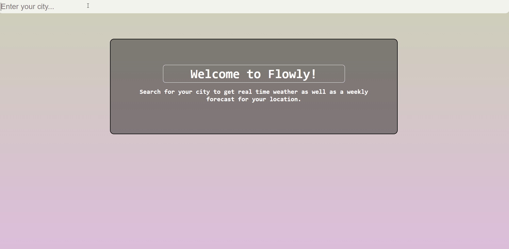

# Flowly
Weather tracker app made with Node.js and React. **[Live Demo](https://thecerealcoder.github.io/flowly/)**



## Table of contents
* [General info](#general-info)
* [Technologies](#technologies)
* [Resources](#resources)
* [Setup](#setup)

## General info
This project uses the OpenWeather API to gather weather location data and displays it. Just enter your location and receive not only real-time weather data such as temperature, wind, and weather condition, but also a weekly weather forecast that is visualized along a dynamic linear gradient background.
	
## Technologies
Project is created with:
* React (16.13.0)
* Moment (2.24.0)
* React Physics Dragger (1.4.0)
* React Switch (5.0.1)
* FontAwesome

## Resources
* [OpenWeather API](https://openweathermap.org/api) <sup>[*](#footnote)</sup>
* [Weather App Tutorial](https://youtu.be/GuA0_Z1llYU)


## Setup
To run this project, install it locally using npm:

```
$ cd ../lorem
$ npm install
$ npm start
```


<a name="footnote">* </a>: You must generate your own API key in order for this project to work. 
